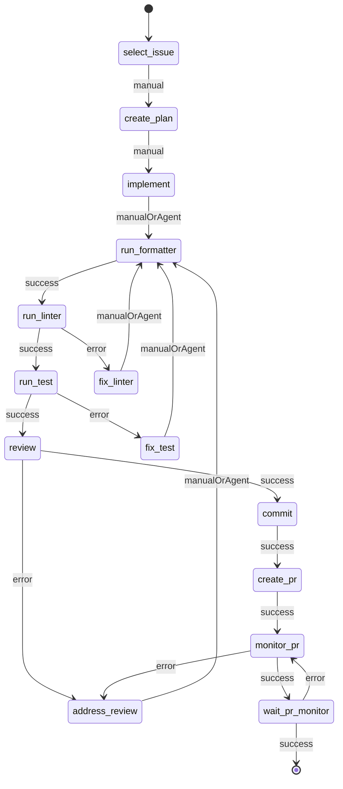

# github-issue-driven-dev

GitHub issue を起点に、plan 作成 → 実装 → formatter/linter/test → review → commit → PR 作成 → PR 監視までを `state-workflow` 上で進める client extension です。

## 目的

- issue 選定基準を workflow に固定する
- AI が担当する工程と、自動化する工程を分離する
- review / commit / PR / PR monitor の履歴を `.pi/workflows/github-issue-driven-dev/current/` に残す

## 主な保存先

- `ISSUE.md`: 選定した issue
- `SELECTION.md`: 選定理由
- `PLAN.md`: 実装計画
- `formatter.log`
- `linter.log`
- `test.log`
- `reviews/review.md`: 単一 review 履歴ファイル
- `COMMITS.md`
- `PR.md`
- `PR_MONITOR.md`
- `meta.json`

## 現在の state 一覧

1. `select-issue`
2. `create-plan`
3. `implement`
4. `run-formatter`
5. `run-linter`
6. `fix-linter`
7. `run-test`
8. `fix-test`
9. `review`
10. `address-review`
11. `commit`
12. `create-pr`
13. `monitor-pr`
14. `wait-pr-monitor`

## 状態遷移図

## 各 state の役割

### 1. `select-issue`
- open issue 一覧と要求文をもとに、対象 issue を 1 件選ぶ
- `ISSUE.md` / `SELECTION.md` / `meta.json` を初期化する

### 2. `create-plan`
- agent に `PLAN.md` の作成を依頼する
- ここではまだ実装しない

### 3. `implement`
- agent が `ISSUE.md` と `PLAN.md` を読み、必要な範囲だけ実装する
- 完了後は `workflow_next` で formatter へ進む

### 4. `run-formatter`
- formatter を実行する
- 成功すると linter へ自動遷移する

### 5. `run-linter`
- linter を実行する
- 失敗時は `fix-linter` へ進む

### 6. `fix-linter`
- linter エラー修正を agent に依頼する
- 修正後は formatter から再実行する

### 7. `run-test`
- test を実行する
- 失敗時は `fix-test` へ進む

### 8. `fix-test`
- test failure 修正を agent に依頼する
- 修正後は formatter から再実行する

### 9. `review`
- reviewer subagent が差分をレビューする
- review は `reviews/review.md` に追記される
- `REVIEW: ACCEPTED` なら commit へ進む
- `REVIEW: REJECTED` なら `address-review` へ進む

### 10. `address-review`
- review 指摘の修正を agent に依頼する
- 修正内容も review 履歴に追記する想定
- 修正後は formatter から再実行する

### 11. `commit`
- committer subagent が論理的な git commit を作成する
- 結果を `COMMITS.md` に保存する

### 12. `create-pr`
- PR author subagent が `gh pr create` を実行する
- 結果を `PR.md` と `meta.json` に保存する

### 13. `monitor-pr`
- `gh pr view` / `gh pr checks` で PR の状態、workflow 完了状況、コメント変化を確認する
- merge 済み・workflow 未完了・workflow 完了後コメント変化・ユーザー確認待ちを判定する
- 結果を `PR_MONITOR.md` と `meta.json` に保存する
- workflow 完了後にコメント変化があれば review markdown に `REVIEW: REJECTED` を追記し、review 修正フローへ戻す

### 14. `wait-pr-monitor`
- `monitor-pr` の判定結果に応じて次の動作を行う
- `WAIT` の場合は 3 分待ってから `monitor-pr` を再実行する
- `COMPLETED` の場合は merge 完了として workflow を終了する
- `USER_CONFIRM` の場合はユーザー確認待ちメッセージを出して終了する

## subagent の役割

- `issue-reviewer`: diff review
- `issue-committer`: git commit 作成
- `issue-pr-author`: PR 作成
- `issue-pr-monitor`: 旧来の PR / GitHub Actions / CodeRabbit 監視 prompt（現在の monitor handler は `gh` を直接使用）

## 実装上のポイント

- これは skill ではなく、`pi + state-workflow` の client extension
- deterministic な工程は function handler
- agent に判断させたい工程は user message / subagent
- review は `reviews/review.md` に 1 セッション 1 ファイルで集約する

## 現在の制約

- `wait-pr-monitor` は API 制約上、待機ループとユーザー確認待ちの終端処理を兼ねている
- workflow の guard 分岐 API がないため、PR 監視後の詳細分岐は handler 内で `meta.json` に記録した次アクションで表現している

## 関連ファイル

- `workflow.ts`: state 定義
- `index.ts`: handler 登録と command 登録
- `handlers/select-issue.ts`
- `handlers/verification.ts`
- `handlers/review.ts`
- `handlers/commit-pr.ts`
- `subagent.ts`: project agent 呼び出し
- `adrs/001.md`: 設計メモ
