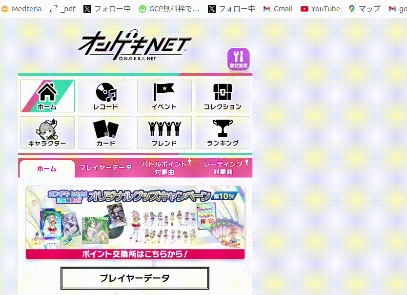
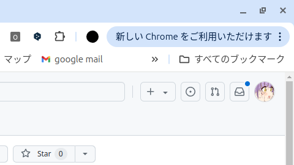
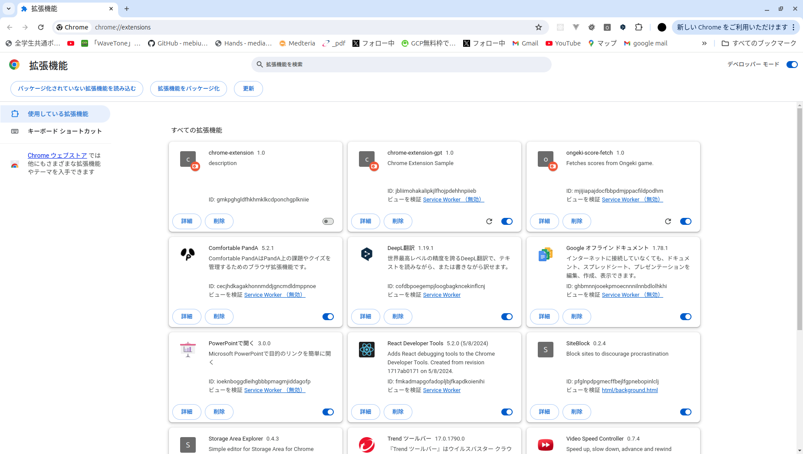

# ongeki-score-fetch

## 概要

オンゲキマイページから、自身の全譜面のスコアデータを取得するためのChrome拡張機能です。

## 使用イメージ



## 取得データ内容

以下のように、BASIC~LUNATIC全譜面の

- 曲名
- 難易度
- レベル
- 譜面定数
- ジャンル
- テクニカルハイスコア
- オーバーダメージハイスコア
- バトルハイスコア
- All Break
- Full Bell
- プラチナスコアハイスコア
- プラチナスコア星
- プラチナスコアマックススコア
- 対戦相手
- 追加バージョン

をCSV形式で出力します。

```csv
曲名,難易度,レベル,譜面定数,ジャンル,テクニカルハイスコア,オーバーダメージハイスコア,バトルハイスコア,All Break,Full Bell,プラチナスコアハイスコア,プラチナスコア星,プラチナスコアマックススコア,対戦相手,追加バージョン
"だから僕は音楽を辞めた",BASIC,2,,POPS＆ANIME,0,0,0,false,false,0,0,0,結城 莉玖,R.E.D.
"春を告げる",BASIC,2,,POPS＆ANIME,1008707,588.51,9268358,true,true,270,0,294,三角 葵,bright
"ヒステリックナイトガール",BASIC,2,,POPS＆ANIME,1007790,663.41,9722283,true,true,312,0,344,早乙女 彩華,bright MEMORY Act.1
```

## 拡張機能のインストール方法

1. Releasesより`ongeki-score-fetch.zip`をダウンロード
2. ダウンロードした`ongeki-score-fetch.zip`を解凍
3. Chromeの拡張機能ページに移動
(chromeタブ右上縦三点アイコンをクリックし「拡張機能を管理」を選択)



4. 「パッケージ化されていない拡張機能を読み込み」を選択



5. 解凍後のフォルダを選択して読み込みを行う

## インストール後の使用方法

1. オンゲキマイページにログイン
2. ログイン後はどのページでも構わないので、拡張機能を開き「スコア情報取得」ボタンをクリック
3. 情報フェッチはバックグラウンドで進行します。拡張機能は閉じていても構いません。<br/>フェッチ終了後スコアデータがダウンロードされます

## 注意

- **スタンダードコースへの加入が必要です**
- タイムアウトは挟んでいますが、拡張機能内でマイページへのアクセスを行っています。**短い期間で連続してダウンロード実行はしないで下さい**
- **作成者は等拡張機能により生じた損害の責務を負いません**
