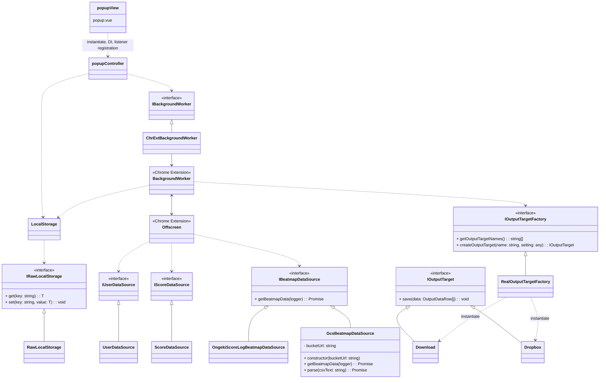

# Chrome Extension アーキテクチャ

## アーキテクチャ概要

以下のアーキテクチャ構成を採用している。



## 設計原則

- **View層**: .vueファイルとして実装。ライフタイムの開始時にcontrollerをインスタンス化し、各インターフェースをDIする
- **Controller層**: データフローとビジネスロジックを担当し、状態を持たない
- **状態管理**: 
  - 1つのライフタイムのみで用いられる状態はviewが管理
  - 複数のライフタイムで用いられる状態の永続化はLocalStorageが行う
- **データフェッチ処理**: ポップアップの1ライフタイムに収まらないため、1つのoffscreenで行う
- **Chrome Extension API**: runtime以外のchrome extension APIを用いる操作は、backgroundにメッセージを送信し移譲する
- **トランザクション管理**: 1offscreen=1トランザクションとして実行状態を明確化

## データフロー

データフェッチ時のBackgroundWorker/Offscreenの起動順序:


## ローカルストレージ設計

### バージョニング構造

ローカルストレージとコントローラの間のやり取りは、IRawLocalStorageとLocalStorageの2層構造を採用している。

```ts
type RawLocalStorageVer1Type = {
    version: 1 as const,
    // バージョン1のデータ構造
}
type RawLocalStorageVer2Type = {
    version: 2 as const,
    // バージョン2のデータ構造
}

// コントローラ層から見たローカルストレージの外部設計
type LocalStorageType = {
    // 統一された外部インターフェース
}
```

### 設計方針

- **IRawLocalStorage**: chrome.storage.localと実際にやり取りする。モックとの差し替えを考慮し、view生成時にDIする
- **LocalStorage**: IRawLocalStorageを利用し、インスタンス化時に生データのバージョンアップ及び生データ整形を行う
- **外部設計**: LocalStorageType型でcontroller層への統一インターフェースを提供

内部的な保存データ形式を変更する場合、RawLocalStorageVer~Typeの定義とLocalStorageのメソッドの更新が必要だが、controller層以降には変更が及ばない。

## GCS譜面データソース設計

### ランダムID付きファイル管理戦略

GcsBeatmapDataSourceは、**可能な限り長くキャッシュを活用しつつ、適切なタイミングでキャッシュを更新する**ランダムID付きファイル名戦略を採用している。

#### ファイル命名規則

- **CSVデータ**: `result-{8桁ランダムID}.csv`（例: `result-af3532b1.csv`）
- **メタデータ**: `result-latest.json`（最新ファイル名を管理）

#### フェッチ戦略

1. `result-latest.json`から最新ファイル名を取得（`cache: 'no-cache'`で常に最新を確認）
2. 取得したファイル名でCSVデータをフェッチ（`cache: 'default'`でキャッシュを最大限活用）
3. ランダムIDにより、譜面データ更新時のみキャッシュを確実に更新

#### キャッシュ最適化

- **メタデータファイル**: 小さなファイルサイズのため、常に最新版をチェックしてもオーバーヘッドは最小限
- **CSVデータファイル**: 大きなファイルサイズのため、同じバージョン（同じランダムID）であればキャッシュから高速取得
- **更新検知**: ファイル名変更により、新しいデータがある場合のみ確実にダウンロード実行

### ファイル構造

#### メタデータファイル（result-latest.json）

```json
{
  "latestFileName": "result-af3532b1.csv",
  "updatedAt": "2024-01-15T10:30:00.000Z"
}
```

- `latestFileName`: 最新のCSVファイル名（ランダムID付き）
- `updatedAt`: ファイル更新日時（ISO 8601形式）

#### 譜面データファイル（result-{ランダムID}.csv）

```csv
title,genre,character,versionMaster,versionLunatic,constantBasic,constantAdvanced,constantExpert,constantMaster,constantLunatic
だから僕は音楽を辞めた,POPS＆ANIME,結城 莉玖,R.E.D.,R.E.D.,,2.0,5.0,8.5,
春を告げる,POPS＆ANIME,三角 葵,bright,bright,,3.0,6.0,9.0,12.5
```

**カラム説明**:
- title: 楽曲の正式名称
- genre: 楽曲ジャンル分類
- character: 担当キャラクター名
- versionMaster: 楽曲追加バージョン（BASIC-MASTER）
- versionLunatic: LUNATIC譜面追加バージョン
- constantBasic-constantLunatic: 各難易度の譜面定数（空文字の場合は未実装）

### データ処理フロー

1. CSVパース（Papa.parseライブラリ使用）
2. 各行を5つの難易度レコードに展開
3. BeatmapDataType配列として返却

### 設計上の利点

1. **最適化されたキャッシュ活用**: ランダムIDにより同じデータは長期間キャッシュされ、新しいデータは確実に取得される
2. **効率的な更新検知**: 小さなメタデータファイルで更新チェックを行い、大きなCSVファイルは必要時のみダウンロード
3. **帯域幅の節約**: 同じバージョンのデータを繰り返しダウンロードすることなく、変更がある場合のみネットワークアクセス
4. **アトミック更新**: メタデータファイルによる一貫性保証
5. **スケーラビリティ**: Cloud Storageの高可用性・高パフォーマンスを活用

## メッセージング仕様

Chrome Extension内部のコンポーネント間通信は、型安全なメッセージング仕様で管理されている。

### メッセージ型定義

```ts
export type ChrExtRuntimeMessageType =
    | {
        type: "is-fetch-processing";
        from: "popup";
        to: "backgroundWorker";
      }
    | {
        type: "start-fetch";
        from: "popup";
        to: "backgroundWorker";
      }
    | {
        type: "start-fetch";
        from: "backgroundWorker";
        to: "offscreenDataFetch";
      }
    | {
        type: "save-fetch-log";
        from: "offscreenDataFetch";
        to: "backgroundWorker";
        logType: "progress" | "error" | "finish";
        logMessage: string;
      }
    | {
        type: "fetch-finished";
        from: "offscreenDataFetch";
        to: "backgroundWorker";
        datas: OutputTargetDataRowType[];
        error?: string;
      };
```

### 通信フロー

- **popup → backgroundWorker**: データフェッチ処理状況確認・開始
- **backgroundWorker → offscreenDataFetch**: データフェッチ処理開始
- **offscreenDataFetch → backgroundWorker**: ログ送信・処理完了通知

## データ型定義

### BeatmapDataType（譜面データ）

```ts
export type BeatmapDataType = {
    name: string;
    genre: string | undefined;
    character: string | undefined;
    version: string | undefined;
    difficulty: BeatmapDataDifficultyType;
    const: number | undefined;
};

export type BeatmapDataDifficultyType =
    | "BASIC"
    | "ADVANCED"
    | "EXPERT"
    | "MASTER"
    | "LUNATIC";
```

### OutputTargetDataRowType（出力データ）

```ts
export type OutputTargetDataRowType = {
    difficulty: OutputTargetDataRowDifficultyType;
    level: string;
    name: string;
    genre: string;
    technicalHighScore: number;
    overDamageHighScore: number;
    battleHighScore: number;
    fullBell: boolean;
    allBreak: boolean;
    const: number | undefined;
    platinumHighScore: number;
    platinumStar: number;
    platinumMaxScore: number;
    character: string | undefined;
    version: string | undefined;
};
```

## ローカルストレージ実装詳細

### 現在のバージョン（Ver.1）

```ts
export type RawLocalStorageVer1Type = {
    version: 1;
    progresses: Array<{
        createdAt: number;
        message: string;
        type: "progress" | "error" | "finished";
    }>;
    outputTarget: "download" | "dropbox";
    outputTargetOptions: {
        dropbox: {
            outputPath: string;
            accessToken?: string;
            expires?: number;
        };
    };
};
```

### デフォルト値

```ts
export const defaultRawLocalStorageVer1 = {
    version: 1,
    progresses: [],
    outputTarget: "download",
    outputTargetOptions: {
        dropbox: {
            outputPath: "ongeki-score-fetch/data.csv",
        },
    },
} as const;
```

### バージョン管理

- **VALID_VERSIONS**: `[1]` - 現在サポートされているバージョン
- **バージョン確認**: LocalStorageコンストラクタでバージョン確認・自動アップグレード
- **データ移行**: 不正バージョンの場合、デフォルト値で初期化

### LocalStorageType（外部インターフェース）

```ts
export type LocalStorageType = {
    progresses: Array<{
        createdAt: number;
        message: string;
        type: "progress" | "error" | "finish";
    }>;
    outputTarget: "download" | "dropbox";
    outputTargetOptions: {
        dropbox: {
            outputPath: string;
            accessToken: string | undefined;
            expires: number | undefined;
        };
    };
};
```

## コンポーネント詳細

### データソース

- **IUserDataSource/UserDataSource**: ユーザーデータの取得
- **IScoreDataSource/ScoreDataSource**: スコアデータの取得  
- **IBeatmapDataSource**: 譜面データの取得（抽象化）
  - **OngekiScoreLogBeatmapDataSource**: オンゲキスコアログからの譜面データ取得
  - **GcsBeatmapDataSource**: Google Cloud Storageからの譜面データ取得

### ストレージ

- **IRawLocalStorage/RawLocalStorage**: chrome.storage.localとの直接やり取り
- **LocalStorage**: バージョニングと生データ整形を担当

### 出力

- **IOutputTarget**: 出力方法の抽象化
  - **Download**: ファイルダウンロード出力
  - **Dropbox**: Dropbox出力
- **IOutputTargetFactory/RealOutputTargetFactory**: OutputTargetの生成

### Extension Components

- **IBackgroundWorker/ChrExtBackgroundWorker**: Background Workerとの通信インターフェース
- **BackgroundWorker**: Chrome Extension のbackground script
- **Offscreen**: Chrome Extension のoffscreen document 