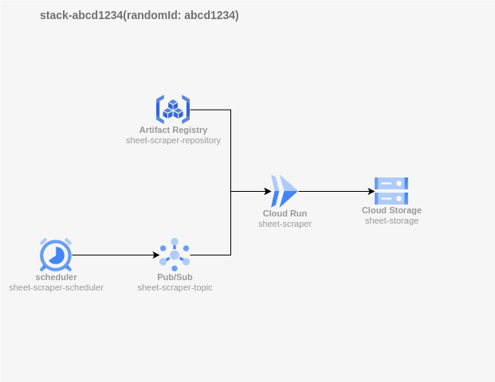
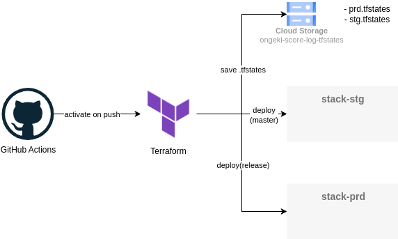

# README - GCP

## 概要

terraformによるGCPのリソース管理を行うためのリポジトリ

## ディレクトリ構造

.gitignoreされるファイル/ディレクトリは、ファイル名先頭に「*」を付与している。

```text
gcp/
├ README.md
├ README.md.images/ # README.mdの画像ファイル
├ .gitignore
├ main.tf # リソース定義
├ variables.tf
├ *terraform.tfvars
├ *terraform.tfstate
├ *terraform.tfstate.backup
├ *terraform.lock.hcl
├ *.terraform/
├ *sheet-scraper.zip # terraform apply時自動生成
├ sheet-scraper/ # cloud run「sheet-scraper」のリポジトリ
   ├ codes/
   ├ package.json
   ├ pnpm-lock.yaml
   ├ tsconfig.json
   ├ .gitignore
   ├ *.env
   ├ env.example # .envの各項目の説明/例
   ├ Dockerfile # cloud run実行イメージ
   ├ *credentials.json # GCPリソースアクセスのための認証情報・ローカルデバッグで使用
   ├ *node_modules/
```

## terraformスタックのデプロイ

### 開発時テスト用

terraformのテストのために1スタックのみをデプロイする場合、

```bash
terraform init # 初回のみ
terraform apply
```

ここで生成されたリソースの名前末尾には、自動生成されたsuffixが付与され、そのsuffixは`terraform apply`時コンソールに表示される。

```text
Apply complete! Resources: 1 added, 0 changed, 0 destroyed.

Outputs:

suffix = "52cd46d0"
```

### テスト環境用

masterブランチへのPR作成時、Github Actionsが起動し、stgスタックに対してTerraformのplanを実行する。

またmasterブランチへのPR作成時、Github Actionsが起動し、stgスタックに対してTerraformのplanを実行する。

### 本番環境用

releaseブランチへマージすると、Github Actionsが起動し、prdスタックに対してTerraformのapplyを実行する。

## cloud runの開発環境について

### sheet-scraper

ディレクトリに移動し

```bash
npm run dev
```

でローカルサーバーを起動する。`http://localhost:8080`にPOSTリクエストを送信することで、譜面情報スクレイピングを開始する。ローカルサーバーの出力する`result.csv`は、cloud storage「sheet-storage-local」に保存される。

## terraformアーキテクチャについての詳細

### 各スタックの構成



- schedulerとPub/Subを用いてCloud Run(sheet-scraper)を起動し、スコアログのデータを取得する
- sheet-scraperはマイページと定数保管所の情報を取得し、sheet-storageに保存する
- sheet-scraperの実行イメージは、sheet-scraper-repositoryに保存する

### TerraformとGithub Actionsについて

リソースのデプロイはTerraformを用いて行う。各スタックには「prd」「stg」または4バイトのランダムな16進数の文字列を割り当て、各リソースの末尾に付与する。

masterブランチへのPRを作成するとGithub Actionsが起動し、stgスタックに対してTerraformのplanを実行する。masterブランチまたはreleaseブランチへのpushがあった場合は、Github Actionsが起動し、それぞれstg,prdスタックに対してTerraformのapplyを実行する。

.tfstatesファイルはCloud Storage(ongeki-score-log-tfstates)に、prd.tfstates,stg.tfstatesとして保存する。


