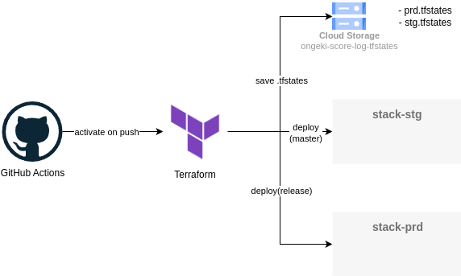
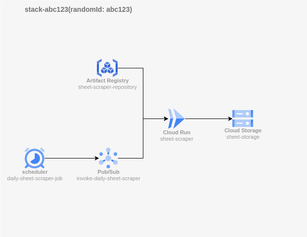

# アーキテクチャ

## TerraformとGithub Actionsについて

リソースのデプロイはTerraformを用いて行う。各スタックには「prd」「stg」または4桁のランダムな16進数の文字列を割り当て、各リソースの末尾に付与する。

masterブランチへのPRを作成するとGithub Actionsが起動し、stgスタックに対してTerraformのplanを実行する。masterブランチまたはreleaseブランチへのpushがあった場合は、Github Actionsが起動し、それぞれstg,prdスタックに対してTerraformのapplyを実行する。

.tfstatesファイルはCloud Storage(ongeki-score-log-tfstates)に、prd.tfstates,stg.tfstatesとして保存する。

## 各スタックの構成

- schedulerとPub/Subを用いてCloud Run(sheet-scraper)を起動し、スコアログのデータを取得する
- sheet-scraperはマイページと定数保管所の情報を取得し、sheet-storageに保存する
- sheet-scraperの実行イメージは、sheet-scraper-repositoryに保存する
