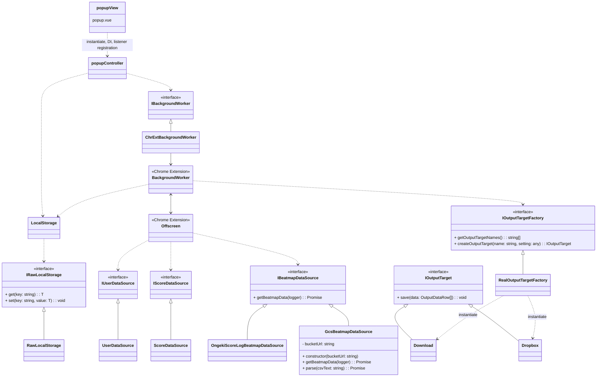

# refactor-1

## 変更項目

1. アダプター層、コントローラー層、ビュー層の分離
2. ローカルストレージのバージョニングと外部設計
3. GCS譜面データソースの追加

## 1. アダプター層、コントローラー層、ビュー層の分離

以下のようなアーキ構成に変更



- viewは.vueとして実装。ライフタイムの開始時controllerをインスタンス化し、各インターフェースをDIする。
- controllerはデータフローとビジネスロジックを担当し、状態を持たない。
- 1つのライフタイムのみで用いられる状態はviewが管理し、複数のライフタイムで用いられる状態の永続化はLocalStorageが行う。
- データフェッチ〜出力までは、ポップアップの1ライフタイムに収まらないため、1つのoffscreenで行う。ただしruntime以外のchrome extension APIを用いる操作は、backgroundにメッセージを送信し移譲する。1offscreen=1トランザクションにする方が、backgroundWorker中心にするよりトランザクションの実行状態がわかりやすいため。offscreenの状況確認や起動はbackgroundWorkerを通して行う。popupControllerはIBackgroundWorkerをインターフェースとしてbackgroundWorkerを操作する。
- ダウンロード、Dropbox出力などの出力方法はIOutputTargetで抽象化する。IOutputTargetは設定事項を表す型Tを持つジェネリクスであり、継承する場合型Tを特殊化して実装する。
- IOutputTargetFactoryでIOutputTargetを生成する際、ターゲット名と各ターゲット固有の設定オブジェクトを渡す。設定オブジェクトは、暫時的にany型とする。
- 譜面データソースはIBeatmapDataSourceで抽象化する。GcsBeatmapDataSourceはGCS（Google Cloud Storage）からランダムID付きファイル名で保存された譜面データをフェッチする。

データフェッチ時のBackgroundWorker/Offscreenの起動順序は以下の通り。


## 2. ローカルストレージのバージョニングと外部設計

ローカルストレージとコントローラの間のやり取りは、IRawLocalStorageとLocalStorageの2層を用いて行う。

- ILocalStorageはchrome.storage.localと実際にやり取りする。モックと差し替えることも考慮し、view生成時DIする。
- LocalStorageはIRawLocalStorageを利用し、インスタンス化時生データのバージョンアップ、及び生データ整形を行う。
- ローカルストレージの外部設計としてLocalStorageType型を定義する。controllerはLocalStorageを利用してLocalStorageType型データに対する操作を行う。

```ts
type RawLocalStorageVer1Type = {
    version: 1 as const,
    // ...
}
type RawLocalStorageVer2Type = {
    version: 2 as const,
    // ...
}
// コントローラ層から見たローカルストレージの外部設計
type LocalStorageType = {
    // ...
}
```

内部的な保存データの形式を変更する場合、RawLocalStorageVer~Typeの定義と、LocalStorageのメソッドの更新が必要だが、controller層以降には変更が及ばない。

## 3. GCS譜面データソースアーキテクチャ

### 3.1 ランダムID付きファイル管理戦略

GcsBeatmapDataSourceは、**可能な限り長くキャッシュを活用しつつ、適切なタイミングでキャッシュを更新する**ランダムID付きファイル名戦略を採用している。

**ファイル命名規則**:

- CSVデータ: `result-{8桁ランダムID}.csv`（例: `result-af3532b1.csv`）
- メタデータ: `result-latest.json`（最新ファイル名を管理）

**フェッチ戦略**:

1. `result-latest.json`から最新ファイル名を取得（`cache: 'no-cache'`で常に最新を確認）
2. 取得したファイル名でCSVデータをフェッチ（`cache: 'default'`でキャッシュを最大限活用）
3. ランダムIDにより、譜面データ更新時のみキャッシュを確実に更新

**キャッシュ最適化**:

- **メタデータファイル**: 小さなファイルサイズのため、常に最新版をチェックしてもオーバーヘッドは最小限
- **CSVデータファイル**: 大きなファイルサイズのため、同じバージョン（同じランダムID）であればキャッシュから高速取得
- **更新検知**: ファイル名変更により、新しいデータがある場合のみ確実にダウンロード実行

### 3.2 GCSから取得するファイル内容

#### 3.2.1 メタデータファイル（result-latest.json）

```json
{
  "latestFileName": "result-af3532b1.csv",
  "updatedAt": "2024-01-15T10:30:00.000Z"
}
```

**フィールド説明**:

- `latestFileName`: 最新のCSVファイル名（ランダムID付き）
- `updatedAt`: ファイル更新日時（ISO 8601形式）

#### 3.2.2 譜面データファイル（result-{ランダムID}.csv）

譜面の属性情報を含むCSVファイル。以下の形式で構成される:

```csv
曲名,ジャンル,キャラクター,バージョン,LUNATIC版バージョン,BASIC定数,ADVANCED定数,EXPERT定数,MASTER定数,LUNATIC定数
だから僕は音楽を辞めた,POPS＆ANIME,結城 莉玖,R.E.D.,R.E.D.,,2.0,5.0,8.5,
春を告げる,POPS＆ANIME,三角 葵,bright,bright,,3.0,6.0,9.0,12.5
```

**カラム説明**:

- 曲名: 楽曲の正式名称
- ジャンル: 楽曲ジャンル分類
- キャラクター: 担当キャラクター名
- バージョン: 楽曲追加バージョン（BASIC-MASTER）
- LUNATIC版バージョン: LUNATIC譜面追加バージョン
- BASIC-LUNATIC定数: 各難易度の譜面定数（空文字の場合は未実装）

**データ処理フロー**:

1. CSVパース（Papa.parseライブラリ使用）
2. 各行を5つの難易度レコードに展開
3. BeatmapDataType配列として返却

### 3.3 設計上の利点

1. **最適化されたキャッシュ活用**: ランダムIDにより同じデータは長期間キャッシュされ、新しいデータは確実に取得される
2. **効率的な更新検知**: 小さなメタデータファイルで更新チェックを行い、大きなCSVファイルは必要時のみダウンロード
3. **帯域幅の節約**: 同じバージョンのデータを繰り返しダウンロードすることなく、変更がある場合のみネットワークアクセス
4. **アトミック更新**: メタデータファイルによる一貫性保証
5. **スケーラビリティ**: Cloud Storageの高可用性・高パフォーマンスを活用
