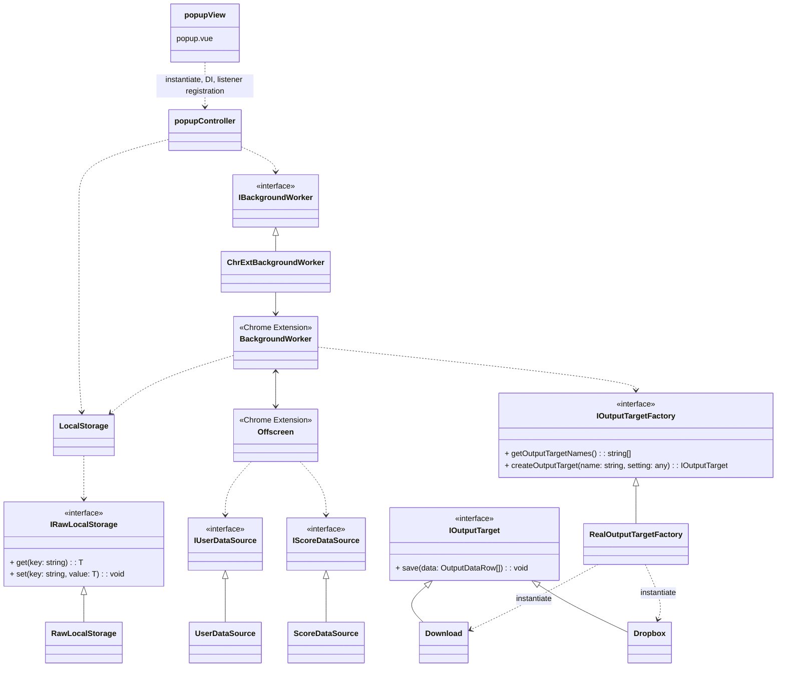

# refactor-1

## 変更項目

1. アダプター層、コントローラー層、ビュー層の分離
2. ローカルストレージのバージョニングと外部設計

## 1. アダプター層、コントローラー層、ビュー層の分離

以下のようなアーキ構成に変更



- viewは.vueとして実装。ライフタイムの開始時controllerをインスタンス化し、各インターフェースをDIする。
- controllerはデータフローとビジネスロジックを担当し、状態を持たない。
- 1つのライフタイムのみで用いられる状態はviewが管理し、複数のライフタイムで用いられる状態の永続化はLocalStorageが行う。
- データフェッチ〜出力までは、ポップアップの1ライフタイムに収まらないため、1つのoffscreenで行う。ただしruntime以外のchrome extension APIを用いる操作は、backgroundにメッセージを送信し移譲する。1offscreen=1トランザクションにする方が、backgroundWorker中心にするよりトランザクションの実行状態がわかりやすいため。offscreenの状況確認や起動はbackgroundWorkerを通して行う。popupControllerはIBackgroundWorkerをインターフェースとしてbackgroundWorkerを操作する。
- ダウンロード、Dropbox出力などの出力方法はIOutputTargetで抽象化する。IOutputTargetは設定事項を表す型Tを持つジェネリクスであり、継承する場合型Tを特殊化して実装する。
- IOutputTargetFactoryでIOutputTargetを生成する際、ターゲット名と各ターゲット固有の設定オブジェクトを渡す。設定オブジェクトは、暫時的にany型とする。

データフェッチ時のBackgroundWorker/Offscreenの起動順序は以下の通り。


## 2. ローカルストレージのバージョニングと外部設計

ローカルストレージとコントローラの間のやり取りは、IRawLocalStorageとLocalStorageの2層を用いて行う。

- ILocalStorageはchrome.storage.localと実際にやり取りする。モックと差し替えることも考慮し、view生成時DIする。
- LocalStorageはIRawLocalStorageを利用し、インスタンス化時生データのバージョンアップ、及び生データ整形を行う。
- ローカルストレージの外部設計としてLocalStorageType型を定義する。controllerはLocalStorageを利用してLocalStorageType型データに対する操作を行う。

```ts
type RawLocalStorageVer1Type = {
    version: 1 as const,
    // ...
}
type RawLocalStorageVer2Type = {
    version: 2 as const,
    // ...
}
// コントローラ層から見たローカルストレージの外部設計
type LocalStorageType = {
    // ...
}
```

内部的な保存データの形式を変更する場合、RawLocalStorageVer~Typeの定義と、LocalStorageのメソッドの更新が必要だが、controller層以降には変更が及ばない。
